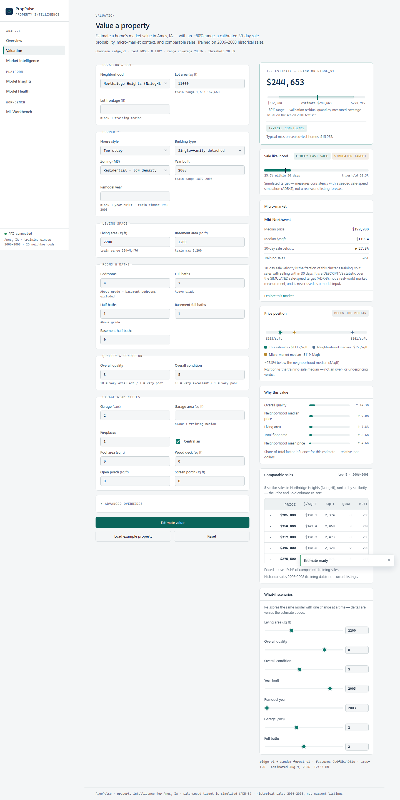
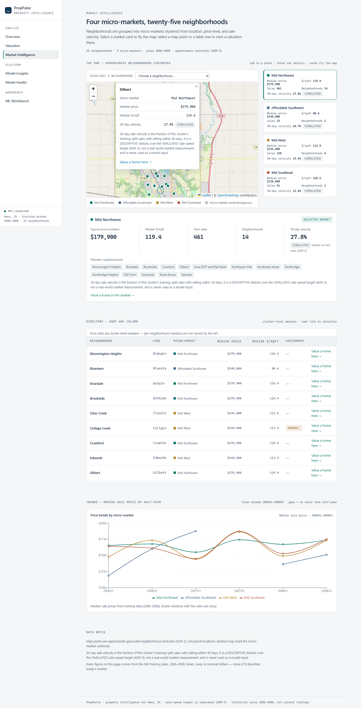
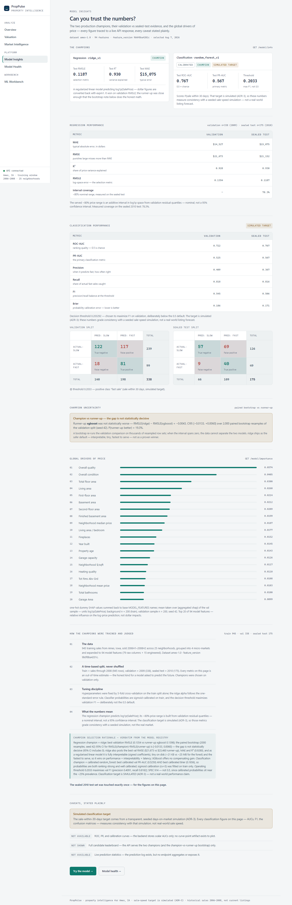
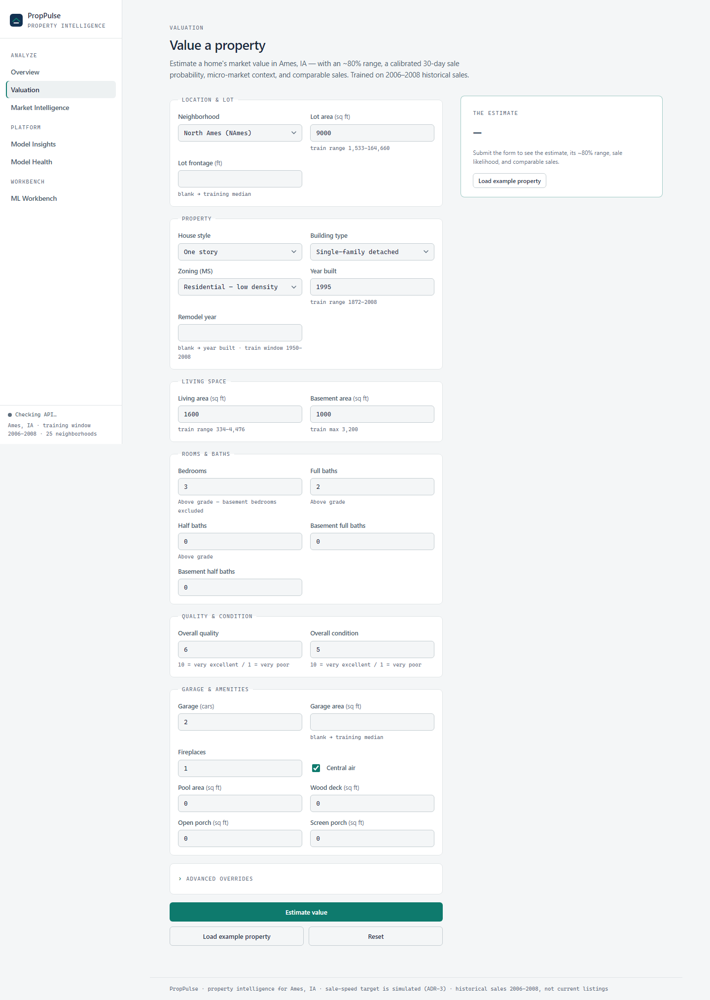
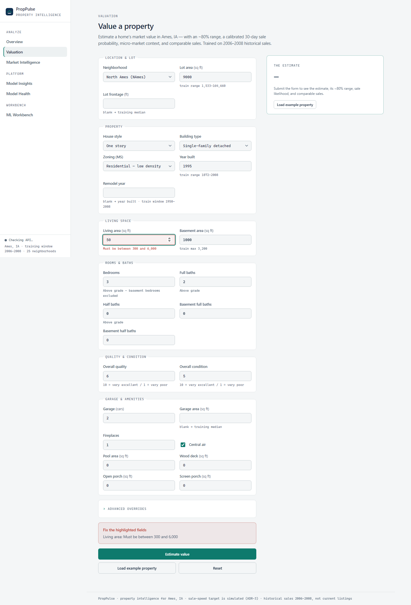

# PropPulse

PropPulse is an end-to-end ML property-valuation platform for residential real
estate in Ames, Iowa. Given the attributes of a property, it estimates:

1. **Sale price** (regression on `log1p(SalePrice)`, served back in dollars),
2. **Probability of selling within 30 days** (calibrated classification — see
   the simulated-target caveat below),
3. **Micro-market segment** (unsupervised clustering of the 25 Ames
   neighborhoods into 4 micro-markets),

and explains each estimate with per-prediction SHAP factors. The models are
served by a FastAPI backend, consumed by a React dashboard, tracked with
MLflow, monitored for data drift with PSI, and packaged with Docker.

The project is a portfolio-grade reference implementation: the emphasis is on
leakage-safe methodology, honest evaluation (time-based split, sealed test
set, statistical champion selection), and reproducibility — not on chasing
the lowest possible error.

## Verification status

Wave-10 release v1.1.0 (2026-08-08) — every row is backed by a committed
report with pasted command output:

| Area | Status | Evidence |
|---|---|---|
| Automated tests | **232 passed, 0 failed, 0 xfail/xpass** (`pytest tests backend/tests -q`, ~51 s, wave-10 final) | `pytest.ini` suite, run below |
| Forensic audit | **Completed** — full-codebase audit (waves A–C); all P2/P3 findings fixed and regression-tested (210 green at audit close) | `docs/audit/FINAL_AUDIT.md` |
| Docker build + smoke | **Verified** (2026-08-07, v1.0.0 build — not re-run in wave 10) — both images build (backend 1.77 GB, frontend 93.9 MB) and pass an in-compose smoke test (`/predict`, `/market/clusters`, CORS preflight, in-container drift check); default ports 8000/8080, alt ports 18000/18080 via the opt-in `docker-compose.alt-ports.yml` | `reports/DOCKER_SMOKE.md` |
| Browser E2E | **27/27 tests pass** — Playwright (Chromium, headless) against the live API; 3 spec files, no mocks in the live specs; wave-10 coverage includes comps, market position, scenario explorer, confidence flags, prefill | `reports/E2E.md` |
| Performance | Warm `/predict` **p50 ≈ 197 ms** (c=1, quiet machine, measured 2026-08-07 on the v1.0.0 build; ~800 ms before the wave-9b fix — contended runs measure 2–3× higher); first call on a fresh process ≈ 0.5 s; 0 errors in 2,000+ measured requests | `reports/PERFORMANCE.md` |
| Reproducibility | **Audit PASS** — processed data + feature artifacts byte-identical on re-run; full retrain matches (ridge Δ = 0.0; calibrated RF Δ ≤ 2.22e-16, one float64 ulp) | `reports/REPRODUCIBILITY.md` |
| Security | Audit applied — security-headers + request-body-limit hardening; 1 accepted CVE (`PYSEC-2026-3552`, `cryptography<50` pinned by mlflow 3.15.1, vulnerable code path unreachable here), now gated in CI (`pip-audit --strict` + `npm audit --audit-level=high`) | `reports/SECURITY.md` |

## Showcase

Full-page captures from the passing Playwright run (1440×900, live API —
reproduce via `reports/E2E.md`):



*Valuation — price hero, ~80% prediction-interval band, calibrated 30-day
probability gauge, micro-market card, and the top-5 SHAP price factors.*



*Market map — 25 neighborhoods colored by micro-market cluster, with a
per-neighborhood stats popup.*



*Model insights — champion cards, 20-bar SHAP importance chart, and the
monitoring & drift panel.*



*Valuation page initial state — form plus empty-state placeholder, API
health indicator in the header.*



*Error state — an API 422 surfaced in the UI, naming the offending field.*

A guided five-minute walkthrough of these screens: **`docs/DEMO.md`**.

## Features

- **Price estimation** with a quantile-based ~80% prediction interval built
  from validation residuals (empirical test coverage 78.3%).
- **30-day sale probability** from a sigmoid-calibrated random forest with an
  operating threshold (0.2033) chosen on validation F1 — not the naive 0.5.
- **Micro-market map**: DBSCAN clusters of neighborhoods over geography +
  market stats, with a serving fallback for noise/unseen neighborhoods.
- **Comparable sales + market position**: `/market/comps` returns the most
  similar train-split sales (2006–2008 only — val/test are never served as
  comps) with the subject's price percentile, and the valuation result
  strips the subject's $/sqft against neighbourhood and micro-market
  medians.
- **What-if scenario explorer**: adjust scenario levers and re-score live —
  the remodel-year slider is capped at the 2008 training-window boundary and
  reduced confidence is surfaced per lever.
- **Market trends**: `/market/trends` serves a startup-cached train-split
  series (half-year median price / sales count per micro-market,
  2006H1–2008H2, honest nulls), charted on the insights page.
- **Per-prediction confidence flags**: calendar clamps and other confidence
  reductions are disclosed in the API response (`confidence.reasons`,
  `calendar_clamped`); a neighbourhood picked on the market map prefills the
  valuation form.
- **Explainability**: global SHAP importance plus per-prediction top factors,
  aggregated from one-hot dummies back to human-readable base features.
- **Monitoring**: every prediction is logged as JSONL; a PSI drift check
  compares live traffic against the train reference and recommends (never
  triggers) retraining.
- **Full MLOps loop**: MLflow experiment tracking, a file-based champion
  registry (`models/registry/` + `models/champion.json`), 232 automated
  tests, Playwright browser E2E, CI, and verified Docker packaging.

## Architecture

```mermaid
flowchart TD
    A[data/raw/ames/train.csv<br/>1460 labeled rows] --> B[ml/data pipeline<br/>ingest → clean → validate → split]
    G[data/external/neighborhood_geo.csv<br/>approx. centroids, ADR-2] --> B
    B --> C[data/processed<br/>train 945 / val 338 / test 175]
    C --> D[ml/features<br/>leakage-safe pipeline, 94 features]
    D --> E[ml/training<br/>5 regression + 4 classification candidates]
    C --> F[ml/clustering<br/>DBSCAN micro-markets]
    E --> H[ml/evaluation<br/>CV, sealed test, champion selection]
    F --> H
    H --> I[models/registry + champion.json<br/>MLflow file store mlruns/]
    H --> J[ml/explainability<br/>SHAP artifacts + per-prediction service]
    I --> K[backend FastAPI<br/>/predict /market/clusters /model/info /metrics /health]
    J --> K
    K --> L[frontend React dashboard<br/>Valuation | Market Map | Model Insights]
    K --> M[ml/monitoring<br/>prediction log → PSI drift check → retrain recommendation]
    M --> K
```

See `docs/ARCHITECTURE.md` for the component table and the prediction
request-flow sequence diagram.

## Dataset

Source: Kaggle **"House Prices: Advanced Regression Techniques"** —
residential sales in Ames, Iowa, 2006–2010, compiled by Dean De Cock:

> Dean De Cock (2011). "Ames, Iowa: Alternative to the Boston Housing Data as
> an End of Semester Regression Project", *Journal of Statistics Education*,
> 19(3). https://doi.org/10.1080/10691898.2011.11889627

The competition archive (`house-prices-advanced-regression-techniques1.zip`)
is vendored at the repo root; extraction and license notes are in
`data/README.md`. Only `train.csv` (1,460 rows × 81 columns, labeled) is
used — the Kaggle `test.csv` has no `SalePrice` and is never used for
evaluation. `data_description.txt` is the authoritative reference for column
meanings and NA semantics.

Headline figures (train split, n = 945): median price $164,990, mean
$182,125, range $35,311–$755,000; the raw target is right-skewed (skew 1.967
→ 0.175 after `log1p`), which motivates the log target (ADR-10). Full EDA:
`reports/EDA_REPORT.md`.

### Documented data fallbacks

Two gaps in the raw data are filled by explicit, documented fallbacks
(see `docs/DECISIONS.md` ADR-2/ADR-3):

1. **No per-property coordinates.** The dataset has `Neighborhood` (25 areas)
   but no lat/long. `data/external/neighborhood_geo.csv` maps each
   neighborhood to an **approximate real-world centroid** in Ames (computed
   from the geocoded companion dataset and cross-checked against
   OpenStreetMap — method in `data/README.md`). Geographic resolution is
   therefore the neighborhood, not the street. To use real coordinates, add
   `lat`/`long` columns upstream of `ml.features` — the pipeline passes them
   through when present. A per-property override is also wired: drop
   `data/external/property_geo.csv` (`Id,lat,long`, validated at load, not
   committed) into the repo and matched rows get real coordinates plus a
   recomputed `distance_to_city_center_km` — models must be retrained to
   benefit (`docs/GEOGRAPHY.md` §4).
2. **No days-on-market (DOM).** `ml/data/sale_speed.py` simulates
   `days_on_market` from a transparent, seeded (seed 42) function of real
   features (pricing vs. neighborhood median, quality/condition, seasonality)
   and derives `sells_within_30_days`. **Exact label used throughout:
   "SIMULATED TARGET — classification metrics are not real-world performance
   claims."** The real-data adapter is live: run the pipeline with
   `DOM_PROVIDER=csv` (plus `DOM_CSV_PATH`, default
   `data/external/days_on_market.csv`) to build the splits from an observed
   `Id,days_on_market` CSV instead — the file is strictly validated at load
   (columns, dtypes, duplicate Ids, 1–365 range, ≥95% Id coverage) and a
   retrain checklist is documented in `data/README.md` ("Using real
   days-on-market data").

## ML methodology (summary)

Full detail in `docs/METHODOLOGY.md`; the short version:

- **Time-based split** (ADR-4): train = sales ≤ 2008 (945 rows), val = 2009
  (338), test = 2010 (175). No shuffling across time; the test split is
  sealed and was read exactly once, after champion selection.
- **Leakage controls**: every aggregate statistic (neighborhood medians,
  LotFrontage imputation, reference distributions) is fit on train only and
  persisted as an artifact reused at serving time. Per-row target-derived
  values (`price_per_sqft`) are EDA/clustering-only; `SaleType`/
  `SaleCondition` are excluded (not knowable pre-listing); the DOM target
  columns are never features.
- **Tuning**: 5-fold CV on the train split only (scoring: log-space RMSE for
  regression, average precision for classification); ridge/lasso alpha by the
  one-standard-error rule (ridge shipped alpha=100 although the grid best was
  31.6); tree models tuned with `RandomizedSearchCV` (n_iter=8).
- **Calibration & threshold**: sigmoid `CalibratedClassifierCV(cv=5)` fit on
  train; champion selection considers calibrated variants only. The operating
  threshold (0.2033) maximizes validation F1 — calibrated probabilities sit
  near the ~25% prevalence, so 0.5 would give recall 0.08 instead of 0.82.
- **Champion selection statistics**: a paired bootstrap (2,000 resamples of
  the val split, seed 42) tests the top-2 regression gap.

## Feature engineering (summary)

One pipeline — `ml/features/` — is the single source of truth shared by
training, evaluation, clustering, and the API (no feature logic is
re-implemented anywhere else). It produces **94 model features**
(`models/feature_list.json`): 79 raw columns + 11 engineered
(`property_age`, `years_since_remod`, `total_bath`,
`living_area_per_bedroom`, `bathroom_bedroom_ratio`, `total_sf`,
`sale_month/quarter/year`, `distance_to_city_center_km` via haversine to
downtown Ames, `amenity_count`) + 4 train-only neighborhood statistics
(median/mean price, median price per sqft, monthly sale velocity — persisted
in `models/neighborhood_stats.json` with a global fallback for unseen
neighborhoods). Preprocessing (imputation, one-hot with
`handle_unknown="ignore"`, scaling) lives inside the sklearn Pipelines, so
each saved model is one self-contained joblib.

## Models and champions

Candidates: 5 regression (linear, ridge, lasso, random forest, XGBoost) and
4 classification (logistic, decision tree, random forest, XGBoost — each with
a calibrated variant). Champions are selected on **validation** metrics only
(regression: RMSLE primary; classification: PR-AUC primary + Brier check) and
live in `models/registry/` with metadata in `models/champion.json`
(full results: `reports/MODEL_EVALUATION.md`).

### Regression champion — ridge (v1)

| split | MAE | RMSE | R² | RMSLE |
|---|---|---|---|---|
| val (2009, 338 rows) | $14,527 | $21,673 | 0.9280 | 0.1354 |
| test (2010, 175 rows, sealed) | $15,075 | $21,152 | 0.9305 | 0.1187 |

Runner-up XGBoost (val RMSLE 0.1398) is close: the paired bootstrap 95% CI
for RMSLE(ridge) − RMSLE(xgboost) is [−0.0133, +0.0060], which includes 0 —
**the gap is not statistically decisive**. Ridge wins on the tie-breakers:
best val RMSE/MAE/R² as well, fully interpretable signed coefficients, ~21 KB
on disk, and the fastest to serve. (On the sealed test split XGBoost actually
posts the lower RMSLE, 0.1051 — another reason the bootstrap matters more
than the point estimate; selection is locked to validation by design.)

### Classification champion — calibrated random forest (v1), threshold 0.2033

| split | ROC-AUC | PR-AUC | F1 | precision | recall | Brier |
|---|---|---|---|---|---|---|
| val | 0.7218 | 0.5250 | 0.5455 | 0.4091 | 0.8182 | 0.1856 |
| test | 0.7666 | 0.5674 | 0.5063 | 0.3670 | 0.8163 | 0.1710 |

**SIMULATED TARGET (ADR-3)** — these numbers measure consistency with the
documented DOM simulation, not real-world sale-speed performance.

### Micro-market clustering

DBSCAN (`eps=1.317`, `min_samples=2`, eps chosen by the k-distance knee
heuristic) over the 25 neighborhoods on scaled
`[lat, long, median_price_per_sqft, monthly_sale_velocity]` (train-split
stats only) finds **4 micro-markets** (mid northwest, affordable southwest,
mid west, mid southeast) plus **3 noise neighborhoods** (CollgCr, NAmes,
Timber — 12% of points). At serving time, noise or unseen neighborhoods map
to the nearest cluster centroid in scaled space and the response is flagged
`fallback: true`. Details: `docs/agent-log/clustering.md`,
`models/clustering/cluster_stats.json`.

### Explainability

SHAP on the ridge champion (`shap.LinearExplainer`, 200-row train
background), with one-hot dummy contributions summed back to base feature
names so importance reads in human terms (units: `log1p(SalePrice)`). Top
global features by mean |SHAP|: **OverallQual (0.057), OverallCond (0.040),
total_sf (0.030), GrLivArea (0.026)**, 1stFlrSF, TotalBsmtSF, …
(`models/explainability/feature_importance.json`; charts in
`figures/shap_bar.png` / `figures/shap_summary.png`). Per-prediction, the API
returns the top-5 factors with sign and normalized magnitude.

## API

FastAPI service (`backend/`), routes at root level — no `/api/v1` prefix:

| Method | Path | Purpose |
|---|---|---|
| GET | `/health` | liveness + per-model loaded status |
| GET | `/metrics` | request counters, avg latency, latest drift summary |
| GET | `/model/info` | champion metadata, headline metrics, feature version |
| GET | `/model/importance` | global SHAP feature importance (mean \|SHAP\| per base feature) |
| GET | `/market/clusters` | cluster stats + neighborhood map points |
| GET | `/market/trends` | half-year median-price / sales-count series per micro-market (train split, 2006H1–2008H2) |
| POST | `/market/comps` | comparable train-split sales for a subject property + price percentile |
| POST | `/predict` | full bundle: price + range + probability + micro-market + top factors |
| POST | `/predict/price` | price only |
| POST | `/predict/sale-probability` | probability only |

Full request/response schemas, curl examples, and error formats:
**`docs/API.md`**. Interactive Swagger UI at `/docs` when the server runs.

## Frontend

Vite + React dashboard (`frontend/`) with three views: **Valuation** (form →
price, range, probability, micro-market card, top factors), **Market Map**
(Leaflet/OpenStreetMap markers colored by cluster with stats popups), and
**Model Insights** (champion metrics, SHAP importance chart, drift summary).
No prediction data is hardcoded — every number comes from the live API. See
`frontend/README.md`.

## Local setup

Prerequisites: Python 3.14 (development environment; CI targets 3.12 — all
pins publish cp312 wheels, but the first CI run is the real proof) and
Node.js 24. All commands from the repo root.

```bash
# 1. Python environment
python -m venv .venv
.venv/Scripts/python.exe -m pip install -r requirements.txt   # Git Bash on Windows
# (Linux/macOS: .venv/bin/python -m pip install -r requirements.txt)

# 2. Environment file (no secrets; safe defaults)
cp .env.example .env

# 3. Rebuild the data pipeline (optional — processed CSVs are committed)
.venv/Scripts/python.exe -m ml.data.pipeline

# 4. Retrain models (optional — trained artifacts are committed)
.venv/Scripts/python.exe -m ml.features.pipeline            # feature artifacts
.venv/Scripts/python.exe -m ml.training.train_regression
.venv/Scripts/python.exe -m ml.training.train_classification
.venv/Scripts/python.exe -m ml.clustering.train
.venv/Scripts/python.exe -m ml.evaluation.evaluate          # reads the sealed test split — run deliberately
.venv/Scripts/python.exe -m ml.explainability.build_artifacts
.venv/Scripts/python.exe -m ml.monitoring.reference

# 5. Backend → http://127.0.0.1:8000 (Swagger UI at /docs)
.venv/Scripts/python.exe -m uvicorn backend.app.main:app --host 127.0.0.1 --port 8000

# 6. Frontend (separate terminal) → http://localhost:5173
cd frontend && npm install && npm run dev
```

Note: the SHAP explainer is built during backend startup (lifespan warm-up,
wave-9b), so no user request pays it — the first `/predict` on a fresh
process is ≈ 0.5 s and warm `/predict` is p50 ≈ 197 ms (c=1, measured on an
otherwise idle machine; contended runs measure 2–3× higher —
`reports/PERFORMANCE.md` "After fix").

## Docker

```bash
cp .env.example .env
docker compose up --build                    # backend :8000, frontend :8080
docker compose --profile mlflow up --build   # + MLflow UI on :5000 (opt-in)
```

Builds are **verified** (2026-08-07, Docker 29.4 / Compose v5.1.1): both
images build cleanly on `python:3.12-slim` / `node:24-alpine` (backend
1.77 GB — dominated by pinned ML runtime deps; frontend 93.9 MB nginx
bundle) and pass an in-compose smoke test — `/health`, `/predict` with 5
populated SHAP factors, `/market/clusters`, `/model/importance`, CORS
preflight from the composed frontend's origin, and an in-container drift
check. Full evidence: **`reports/DOCKER_SMOKE.md`**.

If the default host ports are already taken (as they were on the dev
machine), the repo carries an optional **`docker-compose.alt-ports.yml`** —
committed but **opt-in**: it is deliberately *not* named
`docker-compose.override.yml`, so compose never auto-merges it. Merge it
explicitly to remap to backend **18000**, frontend **18080**, mlflow
**15000**:

```bash
docker compose -f docker-compose.yml -f docker-compose.alt-ports.yml up --build
```

The alt-ports file also re-points the `VITE_API_URL` build arg and backend
`CORS_ORIGINS` to match. On a free machine the base file alone gives backend
:8000 / frontend :8080 exactly as above. The composed frontend works out of
the box — the default `CORS_ORIGINS` in `.env.example` already includes
:8080. Service/env-var reference: `docker/README.md`; walkthrough and
hardening notes: **`docs/DEPLOYMENT.md`**.

## Testing

```bash
.venv/Scripts/python.exe -m pytest tests backend/tests -q   # 232 tests
.venv/Scripts/python.exe -m pytest tests -m integration -q  # end-to-end only
```

`pytest.ini` sets `pythonpath=.` and the `integration` marker (end-to-end
tests that exercise the committed processed data and champion artifacts).
Current status: **232 passed** (~51 s, wave-10 final; 162 at the wave-9
release, 210 post-audit). API tests run through FastAPI's
TestClient against the real champion artifacts.

Browser E2E (separate npm project in `e2e/`, Playwright + Chromium,
headless): **27/27 tests pass** across 3 spec files — `dashboard.spec.js`
(7: valuation flow, valuation-result extras covering confidence / market
position / comps / scenario explorer, map→form prefill, 422 validation
error surfaced in the UI, market map, model insights, API-down degradation)
and `audit-blackbox.spec.js` (11) run against the live API with no mocks;
`frontend-fixes.spec.js` (9) covers mocked-failure and UI regressions. How
to re-run: `reports/E2E.md`.

## Monitoring and drift

- The backend appends every prediction to `logs/predictions.jsonl`
  (best-effort; binding schema in SPEC §10) and the metrics middleware feeds
  `GET /metrics` (counters, latency, latest drift summary).
- `python -m ml.monitoring.drift_check [--window N] [--log PATH]` computes
  per-numeric-feature **PSI** of the recent log window against the train
  reference (`models/monitoring/reference_stats.json`): warn ≥ 0.1, drift ≥
  0.2 (configurable via `DRIFT_PSI_THRESHOLD`). It writes
  `reports/drift/latest.json`, which `/metrics` surfaces.
- `retraining_recommended` is true only when at least one **non-calendar**
  feature drifts **and** the window holds ≥ 200 valid predictions. It is a
  **recommendation flag only — nothing ever retrains automatically**; a
  human reviews and triggers any retraining run.
- Known structural caveat: calendar-derived features (`YrSold`, `MoSold`,
  `sale_year`, `sale_month`, `sale_quarter`, `property_age`,
  `years_since_remod`) always "drift" on post-2010 traffic by construction
  of the time split. They are reported separately under
  `calendar_drift_features` and — since the post-audit fix — calendar-only
  drift never flips `retraining_recommended`. The report also carries
  `low_sample: true` when the window holds < 50 valid predictions
  (small-window PSI is noisy).

## CI

`.github/workflows/ci.yml` runs three jobs on push/PR: **python** (Python
3.12, `pip install -r requirements.txt`, full pytest suite), **frontend**
(Node 24, guarded `npm ci`/`npm install`, `npm run build`), **docker**
(`docker compose config -q` on the base file plus the merged
`docker-compose.alt-ports.yml` config — static validation only; no builds,
no pushes, no secrets; image builds are verified locally —
`reports/DOCKER_SMOKE.md`).

## Project structure

```
├── backend/            # FastAPI service (app/{api,schemas,services,monitoring}, tests/)
├── data/               # raw/ames (Kaggle), external geo lookup, processed splits
├── docker/             # backend/frontend Dockerfiles, nginx.conf, README
├── docs/               # PROJECT_SPEC, DECISIONS (ADRs), ARCHITECTURE, API, DEMO,
│                       # METHODOLOGY, DEPLOYMENT, GEOGRAPHY, screenshots/, agent-log/
├── e2e/                # Playwright browser E2E (own npm project; reports/E2E.md)
├── figures/            # EDA + SHAP + cluster figures (PNG)
├── frontend/           # Vite + React dashboard (src/{pages,components,api})
├── logs/               # predictions.jsonl (runtime prediction log)
├── ml/                 # importable package: data, features, training, evaluation,
│                       # clustering, explainability, monitoring, paths, tracking
├── mlruns/             # MLflow file store (gitignored)
├── models/             # artifacts: regression/, classification/, clustering/,
│                       # explainability/, monitoring/, registry/ (champions),
│                       # champion.json, feature_list.json, ...
├── notebooks/          # 01_eda.ipynb (+ reproducible builder script)
├── reports/            # EDA_REPORT, MODEL_EVALUATION, wave-9 audits (PERFORMANCE,
│                       # SECURITY, REPRODUCIBILITY, E2E, DOCKER_SMOKE), drift/
├── scripts/            # load_test.py, audit_reproducibility.py
├── tests/              # data, features, ml unit tests + integration (marked)
├── .env.example        # all configuration keys (no secrets)
├── docker-compose.yml  # backend + frontend + opt-in mlflow profile
│                       # (+ opt-in docker-compose.alt-ports.yml port remap)
├── pytest.ini          # pythonpath=., integration marker
└── requirements.txt    # pinned dev environment (pandas 2.3.3, sklearn 1.9.0, ...)
```

## Limitations and future improvements

Honest limitations: 1,460 labeled rows from one city in 2006–2010; the DOM
target is simulated; geography is neighborhood-grain; the regression
champion's edge over XGBoost is not statistically significant; calendar
support ends at the training window (YrSold ≤ 2008), so the serving layer
defaults/clamps sale dates to the training-window boundary instead of
extrapolating calendar features — read estimates as "as if sold within the
training window".

Planned improvements:

- Adopt **real days-on-market data** (adapter ready: `DOM_PROVIDER=csv` +
  `DOM_CSV_PATH` — `data/README.md`) and **real per-property geocoding**
  (override ready: `data/external/property_geo.csv` — `docs/GEOGRAPHY.md`)
  in place of the two documented fallbacks, then retrain.
- Richer hyperparameter search (larger budgets, Bayesian HPO) and **nested
  CV** for unbiased model-comparison estimates.
- **Retraining guardrails** around the drift loop (cooldowns, champion/
  challenger promotion gates, data-quality checks before retraining).
- **Authentication/authorization** on the API and stricter CORS for real
  deployments (see `docs/DEPLOYMENT.md`).

## License and data use

The Ames dataset is distributed by Kaggle under the competition's terms
(free for non-commercial, educational/research use with attribution — cite
De Cock (2011) as above). Do not redistribute the raw files outside this
project. See `data/README.md`.
