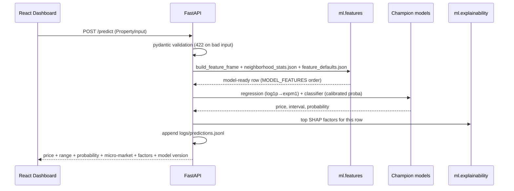

# PropPulse — Architecture

## System overview

```mermaid
flowchart TD
    A[data/raw/ames/train.csv] --> B[ml/data pipeline\ningest → clean → validate → split]
    G[data/external/neighborhood_geo.csv\napprox. centroids] --> B
    B --> C[data/processed/train, val, test]
    C --> D[ml/features\nleakage-safe feature pipeline]
    D --> E[ml/training\nregression: Linear/Ridge/Lasso/RF/XGB\nclassification: LogReg/DT/RF/XGB + calibration]
    C --> F[ml/clustering\nDBSCAN micro-markets]
    E --> H[ml/evaluation\nCV, sealed test, champion selection]
    F --> H
    H --> I[models/registry + champion.json\nMLflow file store mlruns/]
    H --> J[ml/explainability\nSHAP artifacts + per-prediction service]
    I --> K[backend FastAPI\n/predict /market/clusters /model/info /metrics /health]
    J --> K
    K --> L[frontend React dashboard\nValuation | Market Map | Model Insights]
    K --> M[ml/monitoring\nprediction log → PSI drift check → retrain recommendation]
    M --> K
```

## Components

| Component | Location | Responsibility |
|---|---|---|
| Data pipeline | `ml/data/` | raw → validated `data/processed/{train,val,test}.csv` (time split) |
| Features | `ml/features/` | single leakage-safe feature pipeline shared by training + API |
| Training | `ml/training/` | 5 regression + 4 classification models, log-target, calibration, MLflow logging |
| Clustering | `ml/clustering/` | DBSCAN micro-markets over geo + market stats (train), serving lookup |
| Evaluation | `ml/evaluation/` | CV, hyperparameter tuning, champion selection, sealed-test report |
| Explainability | `ml/explainability/` | SHAP global artifacts + per-request top factors |
| Backend | `backend/app/` | FastAPI; thin layer over `ml.*`; pydantic validation; no stack traces |
| Frontend | `frontend/` | Vite + React dashboard consuming the real API |
| Monitoring | `ml/monitoring/`, `backend/app/monitoring/` | PSI drift, prediction log, `/metrics` |
| MLOps | `ml/tracking.py`, `models/registry/` | MLflow file store + champion registry |

## Request flow (prediction)



## Data flow decisions

- **Split:** time-based (train ≤2008 / val 2009 / test 2010); test sealed until final eval.
- **Leakage control:** all aggregate statistics fit on train only and persisted as
  artifacts reused at serving time; per-row target-derived values never enter models.
- **Single pipeline:** preprocessing lives inside sklearn Pipelines → one joblib per model.
- **Paths:** all code resolves paths via `ml/paths.py` or env config; nothing absolute.
