# PropPulse — EDA Report

**Agent:** eda · **Date:** 2026-08-07 · **Dataset version:** ames-1.0
**Source notebook:** [`notebooks/01_eda.ipynb`](../notebooks/01_eda.ipynb) (fully executed, 16/16 code cells with outputs, zero errors — reproducible via `notebooks/build_01_eda.py` + `jupyter nbconvert --execute`).

**Scope & conventions**

- Analysis is on the processed **train** split only: `data/processed/train.csv`, **945 rows × 85 cols** (YrSold 2006–2008), read with `pd.read_csv(..., keep_default_na=False)` per SPEC §14 (zero NaNs; absent features are literal `"None"` strings). `val.csv` (2009, 338 rows) is used **only** in §3.8 to extend the yearly seasonality view. **`test.csv` (2010) was never opened.**
- `lat`/`long` are **approximate neighborhood centroids** (ADR-2) — geographic resolution is the neighborhood.
- `days_on_market` / `sells_within_30_days` are the **SIMULATED TARGET** documented in ADR-3 (`ml/data/sale_speed.py`). All DOM/fast-sale findings below describe the simulation; classification metrics are **not real-world performance claims**.
- `price_per_sqft = SalePrice / GrLivArea` is derived from the target → **EDA-only**, never a model input (SPEC §5 leakage rule).

---

## 1. Headline numbers (all computed on train, n = 945)

| Quantity | Value |
|---|---|
| SalePrice mean / median / std | $182,125 / $164,990 / $78,872 |
| SalePrice range | $35,311 – $755,000 |
| SalePrice skewness: raw → log1p | **1.967 → 0.175** (kurtosis 7.55 → 0.82) |
| price_per_sqft mean / median (EDA-only) | $121.13 / $120.58 per sqft (skew 0.434) |
| Top correlate of SalePrice | **OverallQual, Pearson r = 0.789** (Spearman 0.795) |
| Strongest size correlate | GrLivArea r = 0.752 |
| Neighborhood median spread | **3.18×** — NridgHt $318,000 vs BrDale $100,000 |
| Fast-sale class balance (SIMULATED, ADR-3) | **25.3% fast (239) / 74.7% slow (706)** |
| days_on_market (SIMULATED) | median 41 d, IQR 30–54 d, max 141 d, skew 1.26 |
| Outliers removed by pipeline | 2 partial-sale rows (Ids 524, 1299), train-only |
| High-price rows above IQR fence kept | 39 rows (4.1%) above $341,750 — genuine luxury stock |
| Raw Ames missingness | 19/81 columns; worst PoolQC 99.5% (structural NA) |
| Seasonality | peak July (167 sales), trough Feb (27); median price 2006→2008 **+0.6%** |

---

## 2. Findings by topic

### 2.1 Target distribution — SalePrice and log1p(SalePrice)
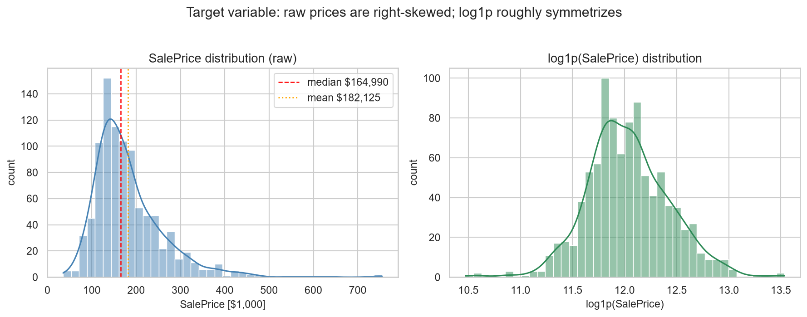

Raw prices are strongly right-skewed (skew **1.967**, excess kurtosis 7.55); the mean ($182,125) sits ~10% above the median ($164,990) because of a premium tail reaching $755,000. After `log1p`, the distribution is close to symmetric (skew **0.175**, kurtosis 0.82). Errors scale with price → the ADR-10 contract (train on `log1p(SalePrice)`, RMSLE primary, dollar metrics via `expm1`) is the right call.

### 2.2 Price per square foot (EDA-only)
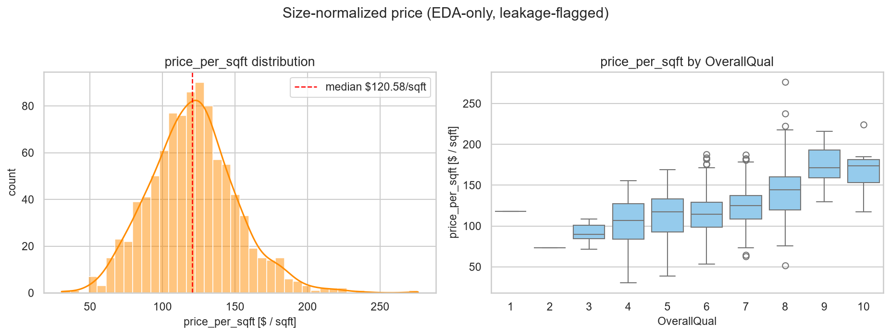

$/sqft is far tighter than raw price (median $120.58 ≈ mean $121.13, skew 0.434): most raw-price skew is a *size* effect, not a price-level effect. $/sqft rises monotonically with OverallQual — quality carries a per-area premium. Leakage-flagged: usable for EDA and clustering (ADR-9) only.

### 2.3 Living area and lot area
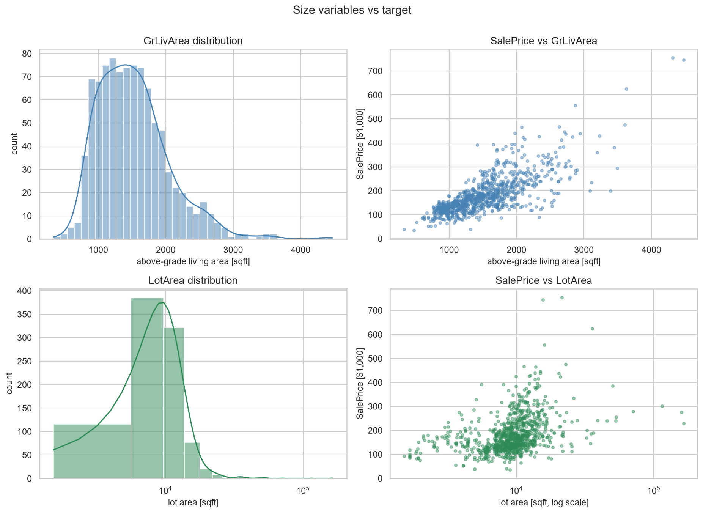

- GrLivArea vs SalePrice: **Pearson 0.752 / Spearman 0.751** — second-strongest numeric; visibly non-linear with variance growing in size (again favors log target + trees).
- LotArea vs SalePrice: Pearson 0.258 raw, **0.388 after log1p** (Spearman 0.461) — weak and extremely skewed (max 164,660 sqft); linear models would want the transform, trees are indifferent.

### 2.4 Bedrooms and bathrooms
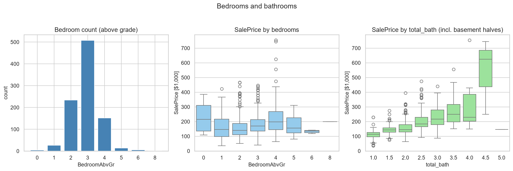

Stock is dominated by 3-bed homes (508/945). Median price rises 2-bed $140,000 → 3-bed $169,495 → 4-bed $197,450, then *drops* for 5+ ($155,700 at 5; tiny samples, big old houses). `total_bath` (SPEC §5 formula incl. basement halves) ranges 1.0–5.0, median 2.0, and beats bedrooms as a predictor: **r = 0.636 vs 0.170**. The engineered bathroom aggregate is justified.

### 2.5 Property age (YrSold − YearBuilt)
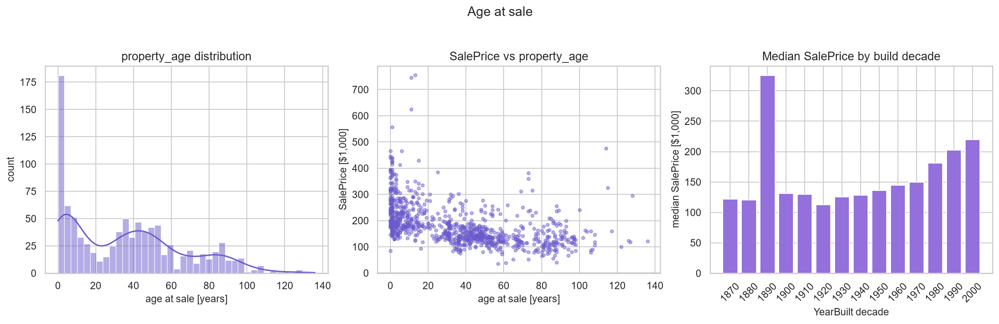

Age at sale: median 35 y, range 0–136 y; r = **−0.493** vs SalePrice. The age distribution is spiky (building booms; 257/945 built in the 2000s decade). Median price by build decade is non-monotone at the old end (1890s median $325,000, n=3 — surviving character homes) while new stock commands a clear premium (2000s $219,500 vs 1950s $135,875). A linear age term understates this; trees or binning capture it. `years_since_remod` is a necessary complement.

### 2.6 OverallQual / OverallCond
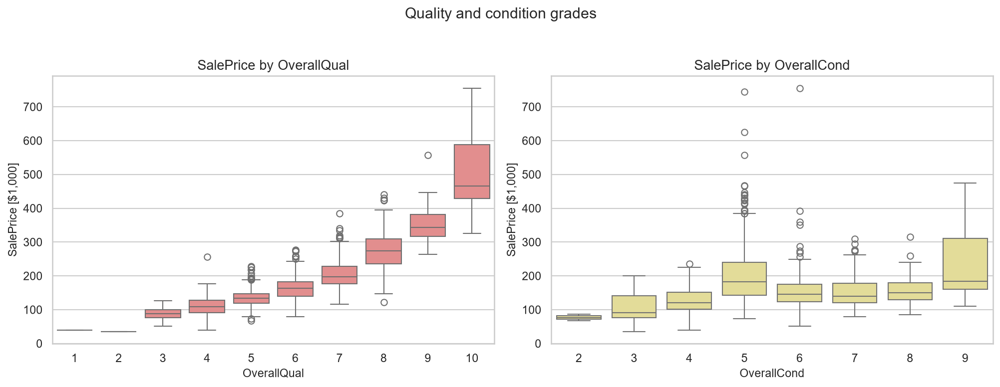

- **OverallQual is the single strongest feature** (r = 0.789): medians climb from $109,454 (Q4) through $197,450 (Q7) to $465,750 (Q10) — the grade ladder is roughly exponential in dollars, again favoring the log target.
- OverallCond is *not* monotone (r = −0.079): 539/945 homes sit at grade 5, and grades 6–9 do not out-price grade 5 (condition is rated relative to age → confounded). Expect little standalone value from it.

### 2.7 Amenity count (SPEC §5 formula)
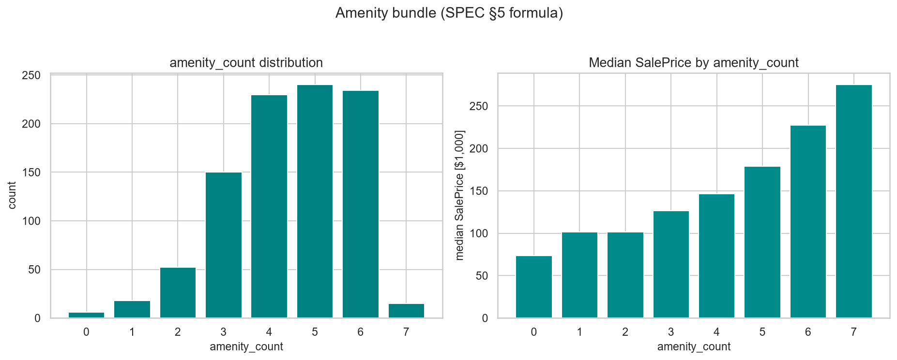

`amenity_count` (0–7 observed, median 5) correlates **r = 0.609** with SalePrice; medians rise smoothly from $73,750 (0 amenities) to $275,000 (7). Component presence: GarageCars 94.2%, CentralAir 93.7%, PavedDrive 91.2% (near-constant, low standalone value), OpenPorch 56.9%, Fireplaces 53.7%, WoodDeck 46.6%, ScreenPorch 7.7%, Pool 0.6%. Partially redundant with quality/size — importance will be shared.

### 2.8 Geography
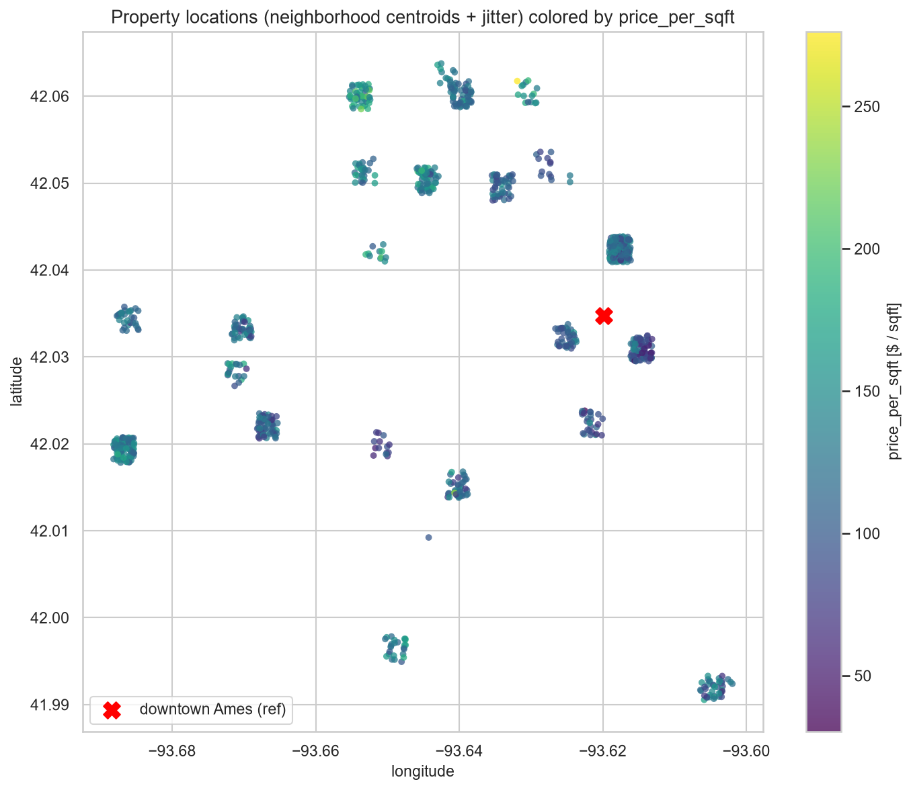

Per-property scatter at neighborhood centroids (seeded jitter, visualization only), colored by price_per_sqft; downtown Ames reference marked. Premium $/sqft concentrates in the **north/northwest** (NridgHt, NoRidge, StoneBr); the southeast (MeadowV, Mitchel) and old central areas (IDOTRR, OldTown, Edwards) are cheapest. Distance-to-center correlates only weakly with price (r = **+0.279**; positive — premium stock is on the outskirts). Location value = neighborhood identity, not radial distance → supports neighborhood stats (SPEC §5) and DBSCAN micro-markets (ADR-9).

### 2.9 Neighborhood price differences (all 25, sorted)
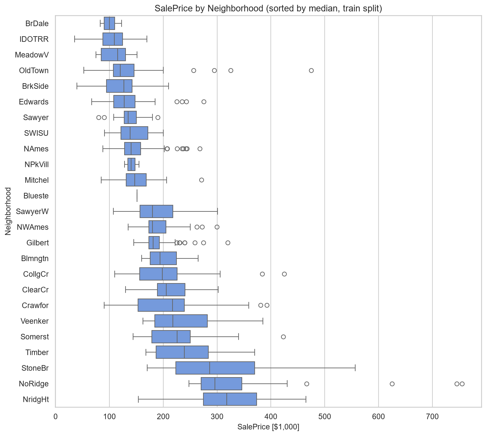

Median prices span **3.18×**: bottom BrDale $100,000, IDOTRR $108,950, MeadowV $115,000; top NridgHt $318,000, NoRidge $295,750, StoneBr $286,000. Low price ≠ low $/sqft everywhere (MeadowV $115,000 median but $117.3/sqft — small homes; SWISU the opposite at $79.9/sqft). Small-n caution: Blueste n=1, NPkVill n=3, MeadowV n=9 — rare-neighborhood stats will be noisy for the train-only stats join.

### 2.10 Days on market and fast-sale target — **SIMULATED (ADR-3)**
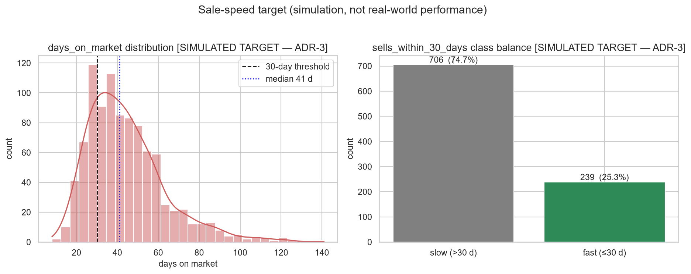

> The DOM fields are produced by the documented, seeded simulation in `ml/data/sale_speed.py` (ADR-3). Numbers below validate the pipeline, not the real Ames market.

Simulated DOM: median 41 d, IQR 30–54 d, max 141 d, right-skewed (1.26). Class balance: **25.3% fast-sale (239/945)** vs 74.7% slow — matches SPEC §14's ≈0.25. Median DOM 25 d (fast) vs 47 d (slow). Modeling must be class-imbalance-aware (class weights; PR-AUC primary per SPEC §6) and every metric must carry the simulated-target label.

### 2.11 Correlation heatmap — key numerics
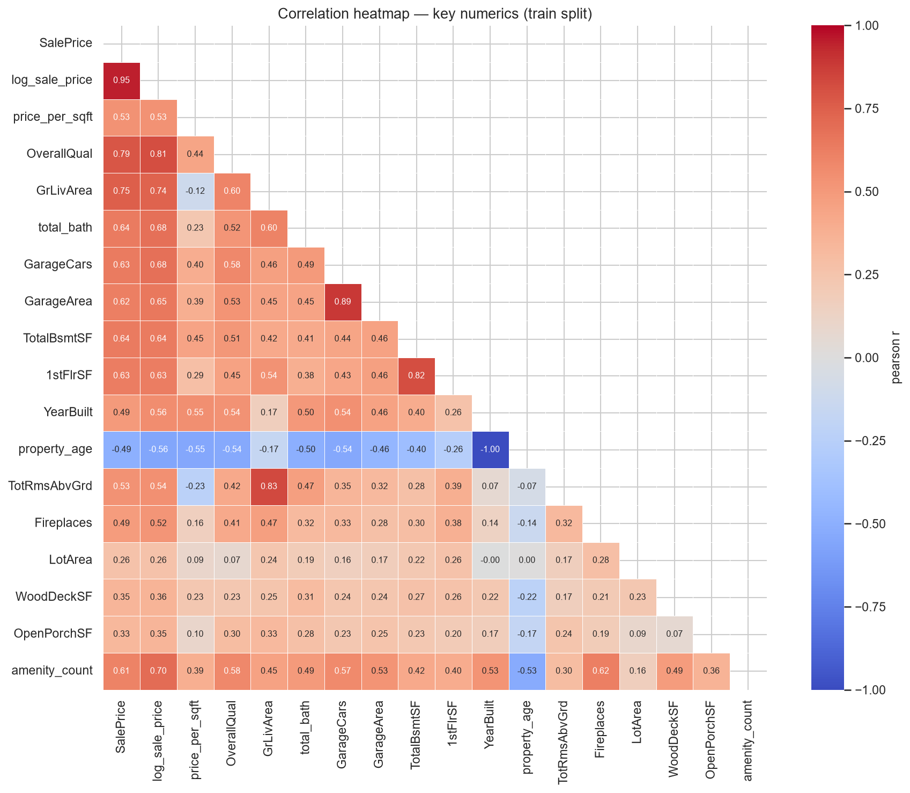

Top |r| vs SalePrice (target-derived columns excluded):

| Feature | Pearson | Spearman |
|---|---|---|
| OverallQual | 0.789 | 0.795 |
| GrLivArea | 0.752 | 0.751 |
| TotalBsmtSF | 0.639 | 0.589 |
| total_bath | 0.636 | 0.707 |
| GarageCars | 0.634 | 0.695 |
| 1stFlrSF | 0.632 | 0.584 |
| GarageArea | 0.618 | 0.644 |
| amenity_count | 0.609 | 0.714 |
| TotRmsAbvGrd | 0.534 | 0.540 |
| YearBuilt | 0.493 | 0.622 |

Heavy multicollinearity inside the size block (GarageCars↔GarageArea 0.89, 1stFlrSF↔TotalBsmtSF 0.82, GrLivArea↔TotRmsAbvGrd 0.83) — trees absorb it; linear models need ridge/lasso and non-causal reading of coefficients. `log_sale_price` correlates more uniformly with drivers than raw price (e.g. OverallQual 0.81 vs 0.79, amenity_count 0.70 vs 0.61), further backing ADR-10.

### 2.12 Missingness — RAW Ames data
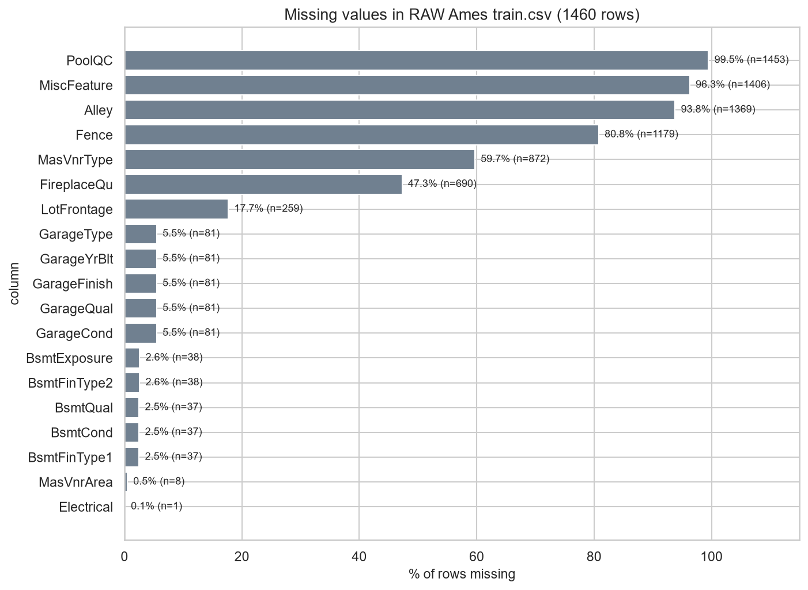

The processed split has zero NaNs by construction; the raw `data/raw/ames/train.csv` (1460×81) has 19 columns with missing values. Worst: PoolQC 99.5%, MiscFeature 96.3%, Alley 93.8%, Fence 80.8%, MasVnrType 59.7%, FireplaceQu 47.3% — all **structural** NAs ("feature absent" per `data_description.txt`), correctly filled as `"None"`, not imputed. Garage block: 5 columns all missing on the same 81 rows (5.5%); basement block ~2.5%. Only **LotFrontage (17.7%)** is a genuine measurement gap → the documented train-fit neighborhood-median imputation (SPEC §4). MasVnrArea (0.5%) and Electrical (1 row) are negligible.

### 2.13 Outlier analysis
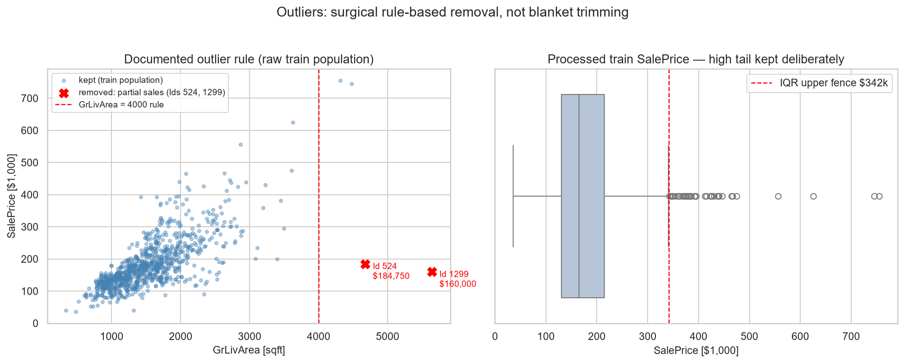

`data/processed/outliers_report.json` documents exactly **2 removals on train** (947 → 945 rows): Ids 524 (4676 sqft, $184,750) and 1299 (5642 sqft, $160,000). Verified in the raw data: both are `SaleCondition = Partial` sales in Edwards — enormous homes sold far below size-predicted price (incomplete/family-transfer sales = measurement artifacts, not market signal). The rule-based removal is correct and SPEC §4-compliant. **No further trimming is proposed:** the 39 rows (4.1%) above the SalePrice IQR fence ($341,750) are genuine luxury stock consistent with their neighborhood/quality context; the log1p target already compresses the tail and tree models are robust to it. Blind IQR/z-score deletion would destroy exactly the high-end signal a valuation model needs.

### 2.14 Seasonality — MoSold / YrSold
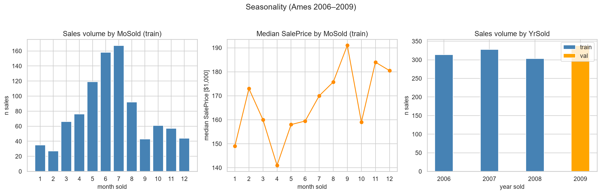

Volume is strongly seasonal: peak **July (167 sales)**, June 158, May 119; trough **February (27)**, January 35. Median price by month moves far less than volume ($141,000 April → $191,000 September, no clean monotone pattern) — seasonality is mostly *transaction volume*, not price level. Yearly (train 2006–2008 + val 2009 shown for continuity): volumes 314/328/303/338; median price 2006→2008 **+0.6%** ($163,995 → $165,000), val-2009 $162,000 — no regime break across the split boundary; the Ames market was comparatively insulated from the 2008 crash. `sale_month`/`sale_quarter` are legitimate but weak features; the time-based split (ADR-4) faces no visible distribution shock.

---

## 3. Implications for modeling

1. **Log target is mandatory.** Skew 1.967 → 0.175 under log1p; errors are multiplicative. Train on `log1p(SalePrice)`, report dollars via `expm1`, RMSLE primary (ADR-10).
2. **Tree ensembles should beat plain linear models** out of the box: non-linear size effects, non-monotone age/condition curves, quality×neighborhood interactions. Keep a linear baseline (interpretable benchmark) with log target + ridge/lasso regularization; transform or bin LotArea/age for it.
3. **Feature expectations:** OverallQual dominates, then the size block (GrLivArea / TotalBsmtSF / Garage*, total_bath), neighborhood, age. Multicollinearity splits importance across near-duplicates — read SHAP in groups, never linear coefficients causally.
4. **Leakage cautions (hard, SPEC §5):** `price_per_sqft` and any per-row `SalePrice` derivative are EDA/clustering-only. Neighborhood stats fit on train only and re-joined to val/test — rare neighborhoods (Blueste n=1, NPkVill n=3) have noisy medians. `days_on_market`/`sells_within_30_days` are targets, never features. `SaleType`/`SaleCondition` are post-hoc (they flagged the two partial-sale outliers) and stay excluded.
5. **Classification target is simulated (ADR-3):** 25.3% fast-sale rate → class-weight-aware training, PR-AUC primary + Brier calibration check; label every metric as simulated.
6. **Preprocessing:** `"None"` is a real category → OneHot(handle_unknown='ignore'); true imputation needed only for LotFrontage (train-fit neighborhood medians). No blanket outlier removal — the 2 partial sales are already trimmed and the luxury tail is signal.
7. **Clustering (ADR-9):** location value lives in neighborhood identity (3.18× median spread) rather than radial distance (r = +0.28); neighborhood-level median $/sqft + velocity + coordinates is the right grain for micro-market discovery.

---

## 4. Figure inventory (all under `figures/`, PNG, dpi = 150, titled axes)

| # | File | Bytes | Content |
|---|---|---|---|
| 1 | `01_saleprice_distribution.png` | 104,334 | raw vs log1p target histograms |
| 2 | `02_price_per_sqft.png` | 86,042 | $/sqft distribution + by OverallQual |
| 3 | `03_living_lot_area.png` | 260,834 | GrLivArea/LotArea distributions + price scatters |
| 4 | `04_bedrooms_bathrooms.png` | 95,384 | bedroom counts, price by bedrooms / total_bath |
| 5 | `05_property_age.png` | 174,379 | age distribution, price vs age, decade medians |
| 6 | `06_quality_condition.png` | 65,081 | price boxplots by OverallQual / OverallCond |
| 7 | `07_amenity_count.png` | 58,980 | amenity_count distribution + median price |
| 8 | `08_geo_scatter.png` | 140,083 | centroid scatter colored by $/sqft |
| 9 | `09_neighborhood_prices.png` | 96,734 | 25-neighborhood boxplot, sorted by median |
| 10 | `10_days_on_market.png` | 98,038 | simulated DOM histogram + class balance |
| 11 | `11_correlation_heatmap.png` | 251,642 | masked Pearson heatmap, 18 numerics |
| 12 | `12_missingness_raw.png` | 114,361 | raw missingness bar chart (19 columns) |
| 13 | `13_outliers.png` | 146,297 | removed partial sales + kept luxury tail |
| 14 | `14_seasonality.png` | 113,880 | monthly volume/price, yearly volume |

Byte sizes verified on disk 2026-08-07; every file non-empty (> 57 KB). Notebook re-run reproduces all 14 identically.
